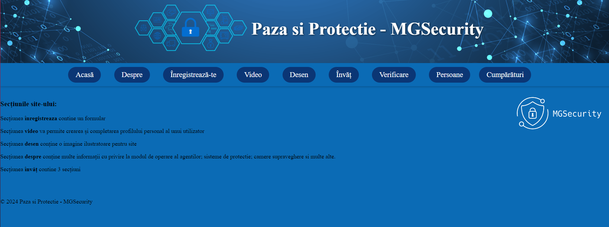

# SecurityWebsite-usingPythonJS

This project is a security and protection website developed using Python and JavaScript. The website provides various sections to register, create and complete user profiles, view illustrative images, and access information about security systems and surveillance cameras.

## Installation and usage

To set up the project locally, follow these steps:

1. Clone the repository:
    ```sh
    git clone https://github.com/Drexel7/SecurityWebsite-usingPythonJS.git
    ```
2. Navigate to the project directory:
    ```sh
    cd SecurityWebsite-usingPythonJS/server_web
    ```
3. Run the server:
    ```sh
    python server_web.py
    ```
4. Open your web browser and navigate to:
    ```
    http://localhost:5678
    ```


## Home page overview



